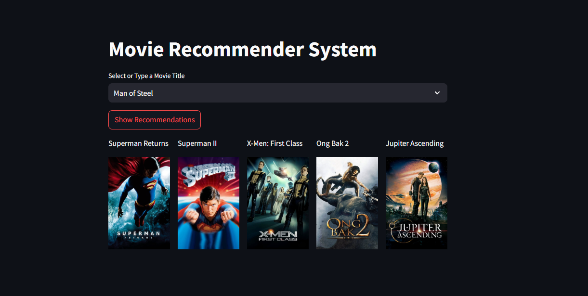
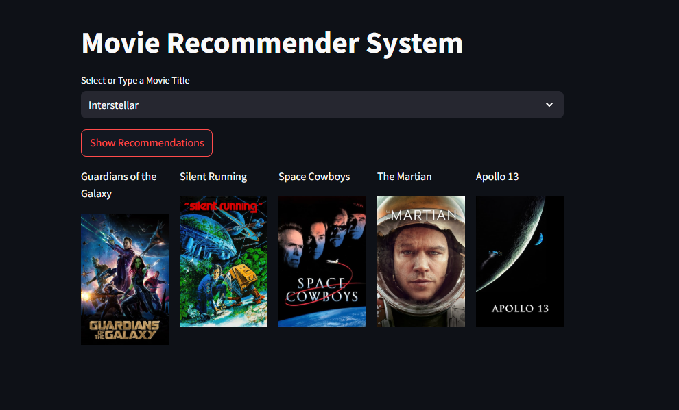

# Movie Recommendation System

This project is a **content-based movie recommendation system** built using Python. The system processes movie data, extracts relevant features, and provides recommendations based on user preferences. It leverages **TMDb 5000 Movies** and **Credits datasets** for analysis and prediction.

- Data Source: [Kaggle TMDb 5000 Dataset](https://www.kaggle.com/datasets/tmdb/tmdb-movie-metadata)
---

## Screenshots




## Features

- **Data Merging**: Combines information from two datasets (`tmdb_5000_movies.csv` and `tmdb_5000_credits.csv`) to create a unified database.
- **Feature Engineering**: Extracts relevant features like genres, keywords, cast, and crew.
- **Content-Based Recommendations**: Recommends movies based on shared features, such as:
  - Genre similarity
  - Common keywords
  - Top cast members
  - Shared directors
- **Optimized Data Preprocessing**:
  - Handles null values and removes duplicates.
  - Converts JSON-like data (genres, keywords, cast) into readable and usable formats.
- **Customized Casting**: Limits the cast feature to the top 3 main actors.

---

## Dataset Details

### 1. TMDb 5000 Movies Dataset
- **Source**: Kaggle
- **Features**:
  - Title, Budget, Revenue
  - Genres, Keywords
  - Popularity, Vote Count, Vote Average
  - Overview, Homepage, Release Date

### 2. TMDb 5000 Credits Dataset
- **Source**: Kaggle
- **Features**:
  - Title
  - Cast (detailed information about actors)
  - Crew (including directors, writers, etc.)

---

## Data Preprocessing Steps

1. **Merging Datasets**: Unified the `movies` and `credits` datasets on the `title` column.
2. **Selected Features**: Filtered for the most relevant columns:
   - `movie_id`, `title`, `overview`, `genres`, `keywords`, `cast`, `crew`
3. **Null Handling**:
   - Dropped rows with missing values in critical columns.
4. **Duplicate Removal**:
   - Ensured no repeated entries in the data.
5. **Data Transformation**:
   - Extracted and converted JSON-like data in `genres`, `keywords`, `cast`, and `crew` columns into usable lists.
6. **Feature Customization**:
   - Limited the cast feature to the top 3 actors using the `top3()` function.
   - Extracted directors using the `fetch_director()` function.

---

## Project Workflow

1. **Exploratory Data Analysis (EDA)**:
   - Analyzed data distribution and cleaned missing values.
2. **Feature Engineering**:
   - Processed `genres` and `keywords` into lists for similarity computation.
3. **Modeling**:
   - Used cosine similarity to compute pairwise movie similarities.
   - Built a recommendation engine based on the computed similarity matrix.
4. **Integration**:
   - Created functions to fetch recommendations for a given movie title.

---

## Installation and Setup

1. Clone the repository:
   ```bash
   git clone https://github.com/your-username/movie-recommendation-system.git
   cd movie-recommendation-system
   ```
2. Install the required dependencies:
   ```bash
   pip install -r requirements.txt
   ```
3. Add the datasets:
   - Place `tmdb_5000_movies.csv` and `tmdb_5000_credits.csv` inside the `data/` directory.

4. Run the project:
   ```bash
   python main.py
   ```

---

## Usage

- **Input**: Provide a movie title.
- **Output**: A list of recommended movies with high similarity based on:
  - Shared genres
  - Common keywords
  - Similar cast or crew

Example:
```python
recommendations = get_recommendations("Avatar")
print(recommendations)
```

---

## Future Enhancements

- Implement **hybrid recommendations** by integrating collaborative filtering.
- Develop a **web interface** using Flask or Streamlit for user interaction.


---

## Acknowledgments

- Data Source: [Kaggle TMDb 5000 Dataset](https://www.kaggle.com/datasets/tmdb/tmdb-movie-metadata)
- Inspiration: Building a robust content-based recommendation system.

---

Let me know if you'd like to add anything else! 😊